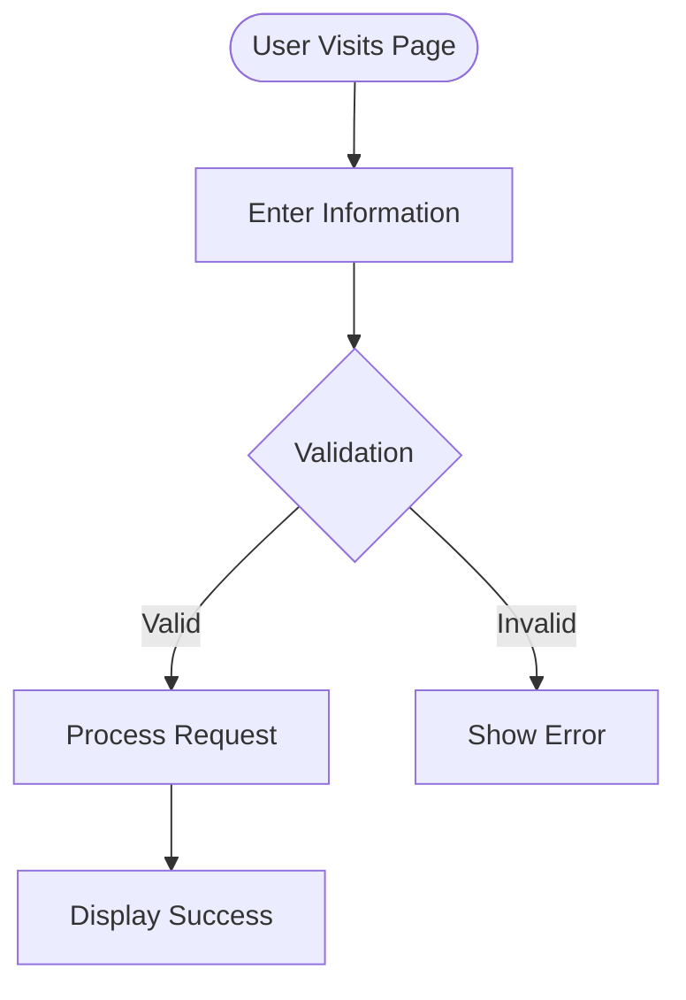
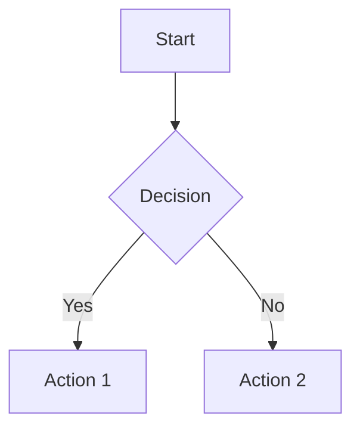
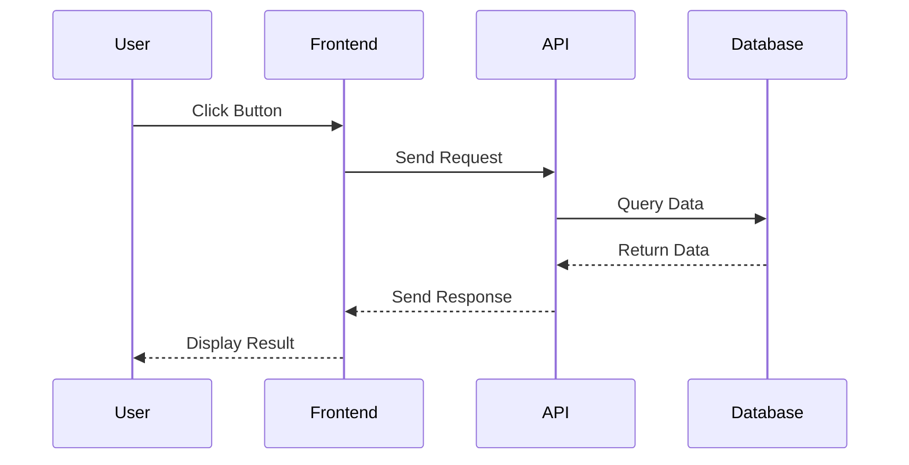
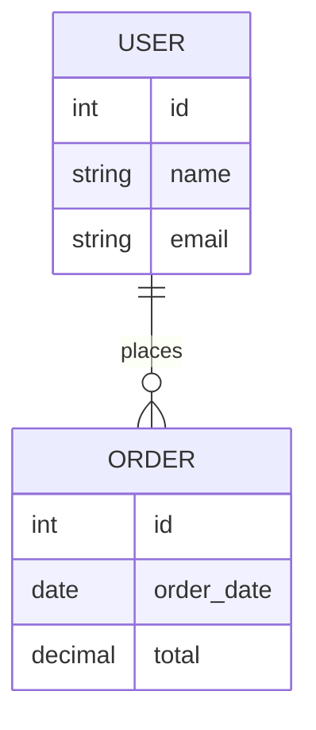
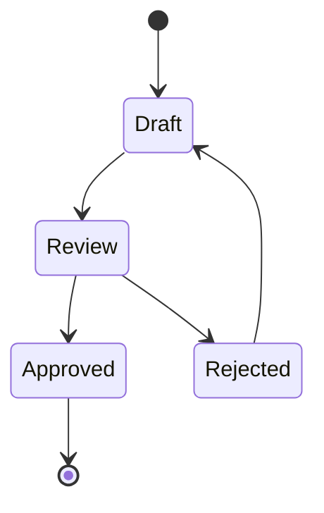

# Documentation Template - Student Guide

## 📚 Overview

Welcome to your project documentation workspace! This repository contains comprehensive templates to help you document your use-case from ideation through implementation. Proper documentation is crucial for successful software projects, and these templates will guide you through industry-standard practices.

## 🎯 Learning Objectives

By completing this documentation, you will:
- Practice structured project documentation
- Understand different stakeholder perspectives (Product Owner vs Technical)
- Learn to write clear requirements with acceptance criteria
- Create technical architecture diagrams
- Map business processes to technical implementations
- Communicate value propositions effectively

## 📁 Documentation Structure

```
docs/
├── INDEX.md              # Project Overview & Summary
├── VALUE_PROPOSITION.md  # Business Value & ROI
├── REQUIREMENTS.md       # Functional & Non-Functional Requirements
├── PROCESSES.md          # Business Process Documentation
├── PLANNING.md          # Stories, Features & Sprint Planning
└── ARCHITECTURE.md      # Technical Architecture & Design
```

## 👥 Role-Based Responsibilities

### 🎨 Product Owner Responsibilities

The Product Owner focuses on **WHAT** to build and **WHY** it matters.

| Document | Sections | Primary Responsibilities |
|----------|----------|-------------------------|
| **INDEX.md** | Project Scope, Stakeholders, Status | Define project goals, identify stakeholders, track progress |
| **VALUE_PROPOSITION.md** | All sections | Define problem, articulate value, create business case, ROI analysis |
| **REQUIREMENTS.md** | Functional Requirements, User Stories, Acceptance Criteria | Write user stories, define acceptance criteria, prioritize features |
| **PROCESSES.md** | Business Process Flows, Business Rules | Document business logic, define process steps, identify edge cases |
| **PLANNING.md** | Epics, Features, User Stories, Sprint Goals | Create product backlog, prioritize stories, define sprint goals |
| **ARCHITECTURE.md** | Quality Attributes, Success Metrics | Define non-functional requirements, acceptance thresholds |

### 💻 Developers/Architects Responsibilities

Developers and Architects focus on **HOW** to build it and **WITH WHAT** technology.

| Document | Sections | Primary Responsibilities |
|----------|----------|-------------------------|
| **INDEX.md** | Technology Stack, Documentation Links | Document technical stack, link to technical resources |
| **REQUIREMENTS.md** | Technical Requirements, Non-Functional Requirements, Definition of Done | Define technical constraints, performance requirements, testing criteria |
| **PROCESSES.md** | Sequence Diagrams, Error Handling, Integration Points | Create technical process diagrams, define error handling, document APIs |
| **PLANNING.md** | Technical Stories, Technical Debt, Subtasks, Estimation | Break down technical implementation, estimate complexity, identify dependencies |
| **ARCHITECTURE.md** | All sections | Design system architecture, create diagrams, document technology decisions |

### 🤝 Collaborative Sections

Some sections require **both roles** to collaborate:

- **Definition of Done** - PO defines business acceptance, Developers define technical completion
- **Acceptance Criteria** - PO defines behavior, Developers ensure technical feasibility
- **Process Diagrams** - PO describes business flow, Developers add technical details
- **Risk Management** - Both identify and mitigate different types of risks

## 📖 How to Use This Template

### Step 1: Start with the Business Case (Product Owner Leads)

**Document:** `VALUE_PROPOSITION.md`

1. **Identify the Problem**
   - What pain points are you addressing?
   - Who experiences these problems?
   - What is the business impact?

2. **Define Your Solution**
   - What are you building?
   - How does it solve the problem?
   - What are the key features?

3. **Calculate Value**
   - What benefits will users gain?
   - What is the ROI?
   - How will you measure success?

**Tips:**
- Be specific with numbers and metrics
- Interview potential users if possible
- Consider both quantitative and qualitative benefits

---

### Step 2: Document Business Processes (Product Owner Leads, Developers Support)

**Document:** `PROCESSES.md`

1. **Product Owner Tasks:**
   - Describe the business process in plain language
   - Define each step of the user journey
   - Identify business rules and validation logic
   - Document edge cases and special scenarios

2. **Developer/Architect Tasks:**
   - Create mermaid.js diagrams (flowcharts, sequence diagrams)
   - Add technical process flows
   - Document integration points with external systems
   - Define error handling procedures

**Example Process Flow:**


**Tips:**
- Start with the happy path, then add exceptions
- Use mermaid.js for visual documentation (examples in template)
- Number your steps clearly
- Define who is responsible for each step

---

### Step 3: Write Requirements (Both Roles Collaborate)

**Document:** `REQUIREMENTS.md`

1. **Product Owner Tasks:**
   ```
   User Story:
   As a [user type]
   I want to [action]
   So that [benefit]
   
   Acceptance Criteria:
   - [ ] Given [context], when [action], then [result]
   ```

2. **Developer/Architect Tasks:**
   - Add technical acceptance criteria
   - Define performance requirements
   - Document security requirements
   - Create Definition of Done checklist

**Example:**

**FR-001: User Login**

*Product Owner writes:*
```
As a registered user
I want to log in with my email and password
So that I can access my personalized dashboard

Acceptance Criteria:
- [ ] User can enter email and password
- [ ] System validates credentials
- [ ] Successful login redirects to dashboard
- [ ] Failed login shows error message
```

*Developers add:*
```
Technical Acceptance Criteria:
- [ ] Password encrypted with bcrypt (10 rounds)
- [ ] JWT token expires after 24 hours
- [ ] Login API response time < 500ms
- [ ] Failed attempts locked after 5 tries

Definition of Done:
- [ ] Unit tests written (>80% coverage)
- [ ] Integration tests passing
- [ ] Security review completed
- [ ] API documentation updated
```

---

### Step 4: Create Project Plan (Product Owner Leads)

**Document:** `PLANNING.md`

1. **Break Down Epics into Features:**
   - Epic = Large body of work (e.g., "User Authentication")
   - Feature = Specific functionality (e.g., "Password Reset Flow")
   - User Story = Individual task (e.g., "Send Password Reset Email")

2. **Prioritize Your Backlog:**
   - What must be in MVP (Minimum Viable Product)?
   - What can wait for later releases?
   - What are the dependencies?

3. **Estimate Complexity:**
   - Use story points (1, 2, 3, 5, 8, 13)
   - Developers help with technical estimates
   - If story is >8 points, break it down further

**Sprint Planning Example:**
```
Sprint 1 Goal: Users can register and log in

Committed Stories:
- [ ] US-001: User Registration Form (5 points)
- [ ] US-002: Email Verification (3 points)
- [ ] US-003: Login Page (3 points)
- [ ] US-004: Session Management (5 points)
Total: 16 points
```

---

### Step 5: Design Architecture (Developers/Architects Lead)

**Document:** `ARCHITECTURE.md`

1. **System Overview:**
   - What are the main components?
   - How do they interact?
   - What external systems are involved?

2. **Create Diagrams:**

   **Container Diagram** - Show major components:
   ```mermaid
   graph TB
       User[User] --> Frontend[Web App]
       Frontend --> API[API Server]
       API --> DB[(Database)]
       API --> Cache[(Redis Cache)]
   ```

   **Data Model** - Show entities and relationships:
   ```mermaid
   erDiagram
       USER ||--o{ ORDER : places
       ORDER ||--|{ ORDER_ITEM : contains
       PRODUCT ||--o{ ORDER_ITEM : includes
   ```

3. **Document Technology Decisions:**
   - Why did you choose this technology?
   - What alternatives did you consider?
   - What are the tradeoffs?

**Architecture Decision Record Example:**
```
ADR-001: Use PostgreSQL for Primary Database

Context: Need a reliable database for user and order data

Decision: Use PostgreSQL instead of MongoDB

Rationale:
- Strong ACID guarantees needed for financial transactions
- Complex queries with multiple joins
- Mature ecosystem and tooling

Alternatives Considered:
- MongoDB: Rejected due to lack of strong consistency
- MySQL: Rejected due to less advanced features

Consequences:
+ Strong data integrity
+ Excellent query performance
- Less flexible schema changes
```

---

### Step 6: Maintain Project Overview (Both Roles)

**Document:** `INDEX.md`

1. **Keep Updated:**
   - Update status regularly
   - Track key metrics
   - Document risks and issues
   - Link to all other documentation

2. **This is your "home page":**
   - New team members should start here
   - Stakeholders check this for quick status
   - Links to all detailed documentation

---

## 🛠️ Working with Mermaid.js Diagrams

Mermaid.js lets you create diagrams using text. Here are the most common types:

### Flowchart (Process Flow)


### Sequence Diagram (System Interactions)


### Entity Relationship Diagram (Data Model)


### State Diagram (Status Transitions)


**Resources:**
- [Mermaid.js Documentation](https://mermaid.js.org/)
- [Live Editor](https://mermaid.live/)
- Templates already include examples in each document!

---

## ✅ Completion Checklist

Use this checklist to ensure you've completed all necessary documentation:

### Product Owner Checklist
- [ ] **VALUE_PROPOSITION.md**
  - [ ] Problem statement clearly defined
  - [ ] Target users identified
  - [ ] Solution overview written
  - [ ] ROI calculated
  - [ ] Success metrics defined

- [ ] **PROCESSES.md**
  - [ ] Main business process documented
  - [ ] Business rules defined
  - [ ] Edge cases identified
  - [ ] Process steps numbered and described

- [ ] **REQUIREMENTS.md**
  - [ ] User stories written for all features
  - [ ] Acceptance criteria defined
  - [ ] Priority assigned to each requirement
  - [ ] Dependencies identified

- [ ] **PLANNING.md**
  - [ ] Epics created and described
  - [ ] Features broken down into user stories
  - [ ] Backlog prioritized
  - [ ] Sprint goals defined

- [ ] **INDEX.md**
  - [ ] Project overview complete
  - [ ] Stakeholders identified
  - [ ] Status updated
  - [ ] Links verified

### Developer/Architect Checklist
- [ ] **ARCHITECTURE.md**
  - [ ] System context diagram created
  - [ ] Container diagram created
  - [ ] Component architecture documented
  - [ ] Data model (ERD) created
  - [ ] Technology stack documented
  - [ ] ADRs written for key decisions
  - [ ] Security architecture documented
  - [ ] Deployment architecture documented

- [ ] **PROCESSES.md**
  - [ ] Technical process flows diagrammed
  - [ ] Sequence diagrams for API interactions
  - [ ] Error handling documented
  - [ ] Integration points defined

- [ ] **REQUIREMENTS.md**
  - [ ] Technical acceptance criteria added
  - [ ] Non-functional requirements defined
  - [ ] Performance benchmarks specified
  - [ ] Definition of Done completed

- [ ] **PLANNING.md**
  - [ ] Technical tasks identified
  - [ ] Story points estimated
  - [ ] Technical dependencies mapped
  - [ ] Technical debt items listed

- [ ] **INDEX.md**
  - [ ] Technology stack documented
  - [ ] Technical documentation linked

---

## 💡 Best Practices

### For Product Owners:
1. **Write from the user's perspective** - Focus on benefits, not features
2. **Be specific** - Vague requirements lead to wrong implementations
3. **Prioritize ruthlessly** - Not everything can be in the first release
4. **Think about edge cases** - What happens when things go wrong?
5. **Validate with users** - Get feedback on your assumptions

### For Developers/Architects:
1. **Document decisions** - Future you will thank present you
2. **Keep diagrams simple** - One diagram, one concept
3. **Be realistic with estimates** - Include time for testing and documentation
4. **Consider non-functional requirements** - Security, performance, scalability matter
5. **Think about maintenance** - Who will support this in production?

### For Teams:
1. **Collaborate early and often** - Don't work in silos
2. **Review each other's work** - Fresh eyes catch issues
3. **Keep documentation updated** - Outdated docs are worse than no docs
4. **Use consistent terminology** - Agree on names for concepts
5. **Link related documents** - Help readers navigate your documentation

---

## 🎓 Common Mistakes to Avoid

### ❌ Mistake 1: Writing too much too early
**Problem:** Spending weeks on perfect documentation before validating ideas  
**Solution:** Start with VALUE_PROPOSITION and key requirements, iterate as you learn

### ❌ Mistake 2: Technical jargon in user stories
**Problem:** "As a user, I want an OAuth2 authentication flow with JWT tokens"  
**Solution:** "As a user, I want to securely log in using my email and password"

### ❌ Mistake 3: Vague acceptance criteria
**Problem:** "The system should be fast"  
**Solution:** "API response time should be < 500ms for 95% of requests"

### ❌ Mistake 4: Skipping the "why"
**Problem:** Just listing features without explaining business value  
**Solution:** Always connect features back to user problems and business goals

### ❌ Mistake 5: Architecture in isolation
**Problem:** Designing architecture without understanding requirements  
**Solution:** Requirements → Architecture → Implementation (in that order!)

### ❌ Mistake 6: No Definition of Done
**Problem:** Disagreement about when a story is "complete"  
**Solution:** Define clear DoD with both business and technical criteria

---

## 📚 Additional Resources

### Documentation Best Practices:
- [C4 Model for Architecture](https://c4model.com/)
- [User Story Mapping](https://www.jpattonassociates.com/user-story-mapping/)
- [Architecture Decision Records](https://adr.github.io/)

### Agile & Scrum:
- [Scrum Guide](https://scrumguides.org/)
- [Agile Manifesto](https://agilemanifesto.org/)

### Mermaid.js Resources:
- [Official Documentation](https://mermaid.js.org/)
- [Live Editor](https://mermaid.live/)
- [Tutorial](https://mermaid.js.org/intro/)

---

## 🆘 Getting Help

### Questions to Ask Yourself:

**"I don't know what to write in [section]"**
→ Look at the template examples, they show exactly what information goes there

**"Is this a Product Owner or Developer task?"**
→ Check the Role-Based Responsibilities table above

**"My diagram isn't rendering"**
→ Copy the example from the template and modify it gradually

**"This requirement seems too big"**
→ If a story is >8 points or takes >5 days, break it into smaller stories

**"We don't have all this information yet"**
→ That's OK! Fill in what you know, mark TBD for the rest, iterate

---

## 🎯 Success Criteria

Your documentation is complete when:

✅ A new team member could understand the project in 30 minutes  
✅ Developers know exactly what to build  
✅ Product Owner can explain the business value  
✅ All diagrams render correctly  
✅ There are no [TODO] or [TBD] placeholders  
✅ All links between documents work  
✅ Each requirement has clear acceptance criteria  
✅ Architecture decisions are explained and justified  

---

## 📝 License & Usage

This template is designed for educational purposes. Feel free to:
- Modify for your specific use-case
- Add additional sections as needed
- Remove sections that don't apply
- Share with your team

---

## 🚀 Ready to Start?

1. **Read this README thoroughly**
2. **Review the template files in the `docs/` folder**
3. **Start with VALUE_PROPOSITION.md**
4. **Work through documents in the recommended order**
5. **Collaborate with your team**
6. **Ask questions when stuck**
7. **Iterate and improve as you learn**

**Good luck with your project! 🎉**

---

*Last Updated: [Date]*  
*For questions or feedback, contact: [Your Contact Info]*

