# Architecture Documentation

## Document Information

- **Version:** 1.0
- **Last Updated:** [Date]
- **Author:** [Name]
- **Status:** [Draft/Review/Approved/Implemented]

## Executive Summary

<!-- Provide a high-level overview of the architecture, key decisions, and rationale -->

## System Overview

### Purpose
<!-- What does this system do and why? -->

### Key Requirements
- **Functional:** [Key functional requirements]
- **Non-Functional:** [Performance, scalability, security, etc.]

### Constraints
- [Technical constraints]
- [Business constraints]
- [Regulatory constraints]

## Architecture Principles

1. **[Principle 1]:** [Description and rationale]
2. **[Principle 2]:** [Description and rationale]
3. **[Principle 3]:** [Description and rationale]

## High-Level Architecture

### System Context Diagram

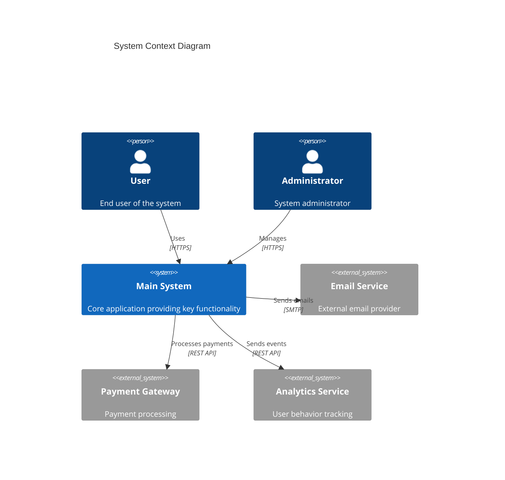

### Container Diagram

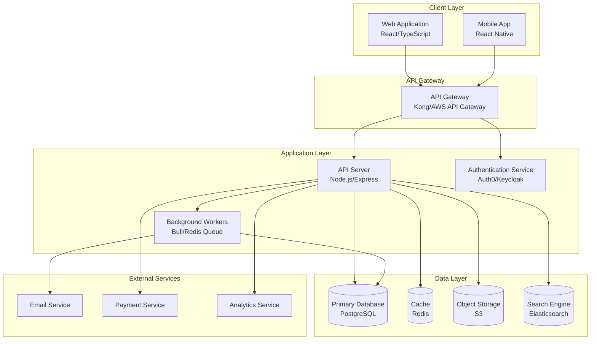

## Detailed Architecture

### Component Diagram

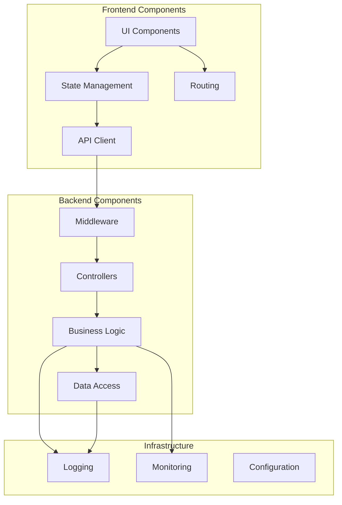

### Layer Architecture

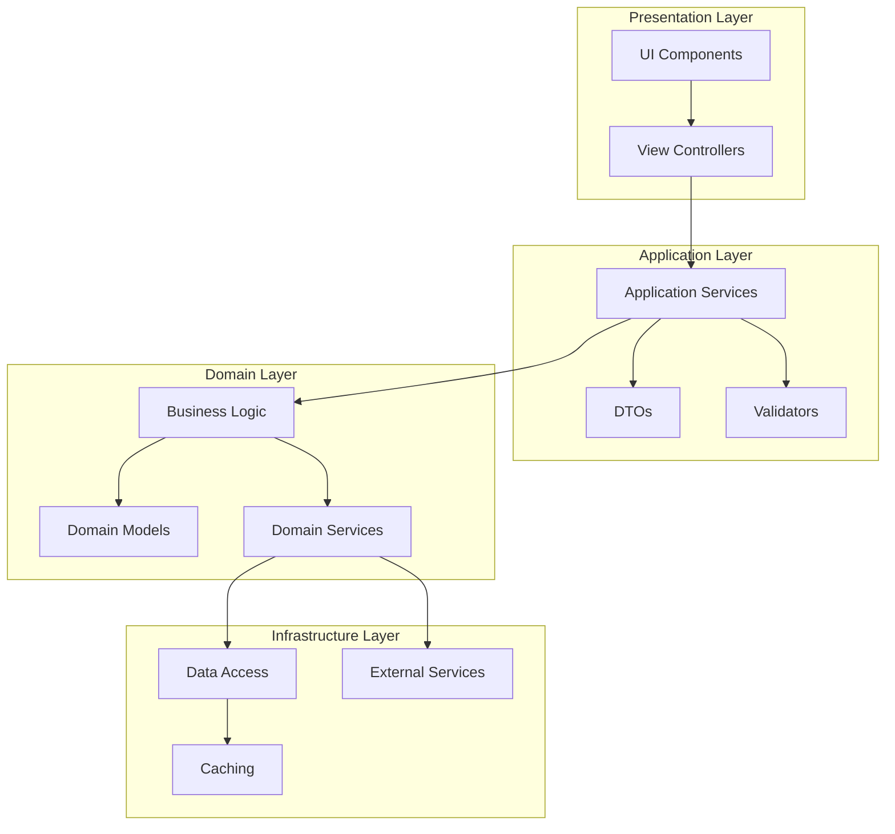

## Data Architecture

### Data Model

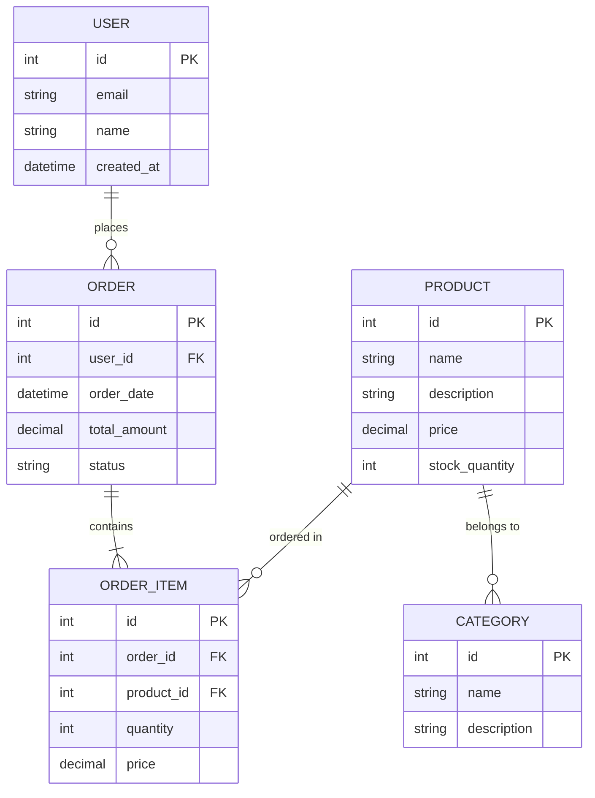

### Data Flow Diagram

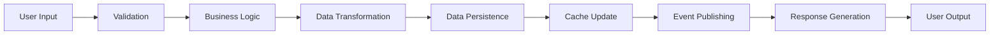

## Integration Architecture

### Integration Patterns

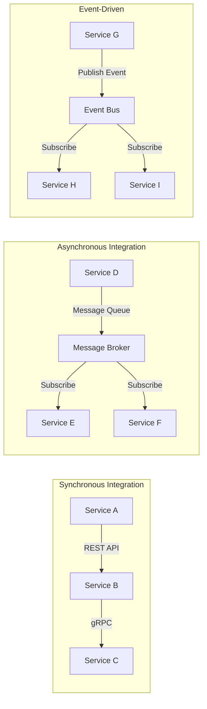

### API Architecture

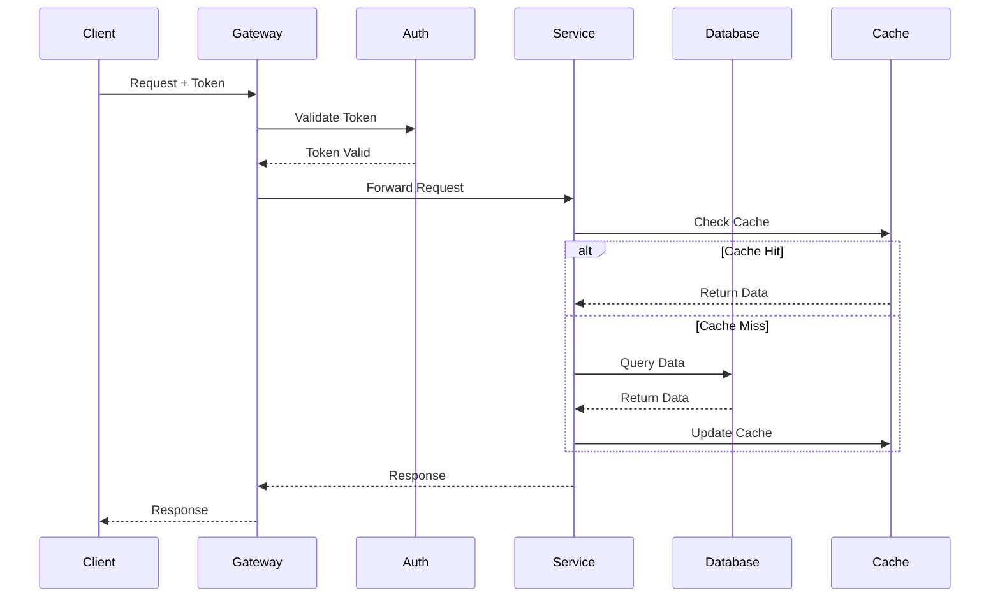

## Security Architecture

### Security Layers

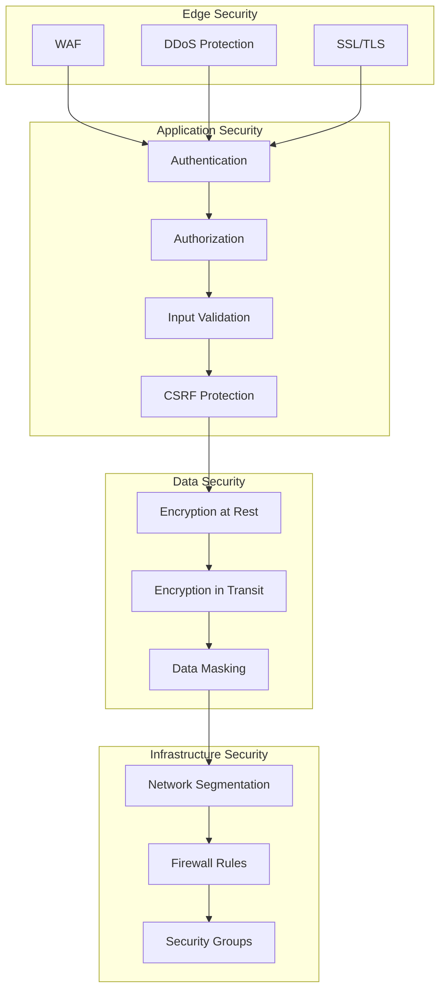

### Authentication & Authorization Flow

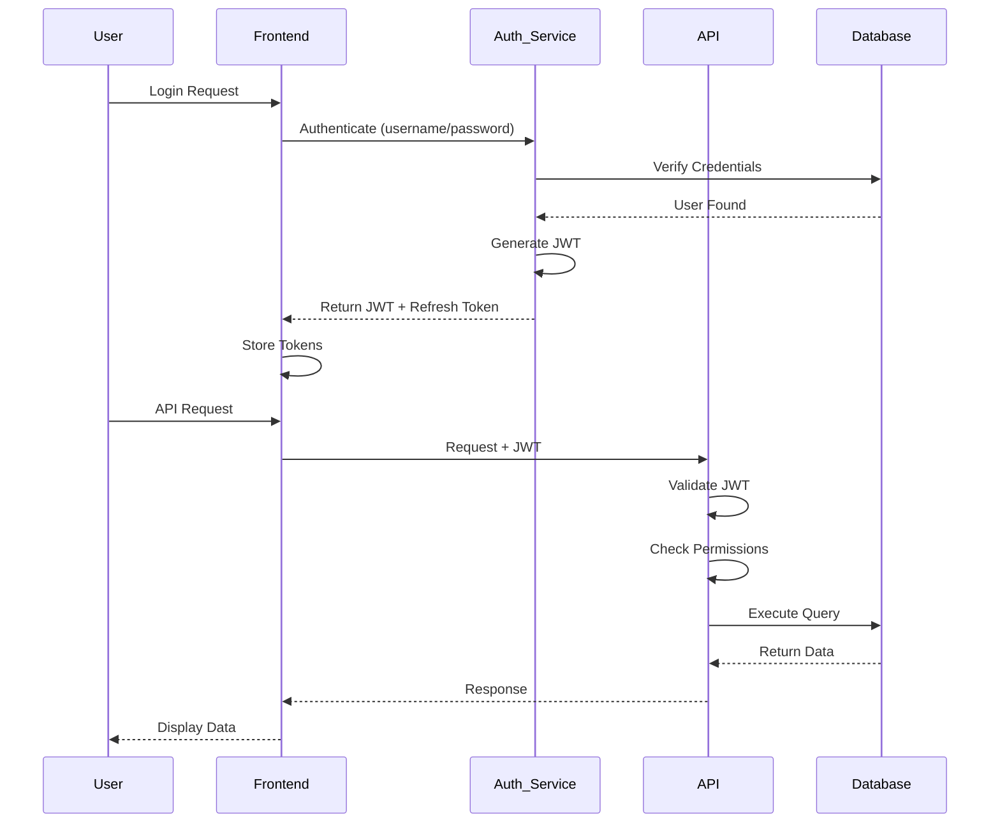

## Deployment Architecture

### Infrastructure Diagram

```mermaid
graph TB
    subgraph "CDN"
        CDN[CloudFront/CloudFlare]
    end
    
    subgraph "Load Balancer"
        LB[Application Load Balancer]
    end
    
    subgraph "Application Tier"
        App1[App Server 1]
        App2[App Server 2]
        App3[App Server 3]
    end
    
    subgraph "Data Tier"
        Master[(Primary DB)]
        Replica1[(Read Replica 1)]
        Replica2[(Read Replica 2)]
    end
    
    subgraph "Cache Tier"
        Redis1[Redis Primary]
        Redis2[Redis Replica]
    end
    
    CDN --> LB
    LB --> App1
    LB --> App2
    LB --> App3
    
    App1 --> Master
    App2 --> Master
    App3 --> Master
    
    App1 --> Replica1
    App2 --> Replica1
    App3 --> Replica2
    
    App1 --> Redis1
    App2 --> Redis1
    App3 --> Redis1
    
    Master --> Replica1
    Master --> Replica2
    Redis1 --> Redis2
```

### Deployment Pipeline

```mermaid
graph LR
    A[Code Commit] --> B[Build]
    B --> C[Unit Tests]
    C --> D[Static Analysis]
    D --> E[Security Scan]
    E --> F[Build Artifacts]
    F --> G[Deploy to Dev]
    G --> H[Integration Tests]
    H --> I[Deploy to Staging]
    I --> J[E2E Tests]
    J --> K[Manual Approval]
    K --> L[Deploy to Production]
    L --> M[Health Check]
    M --> N[Smoke Tests]
```

### Environment Architecture

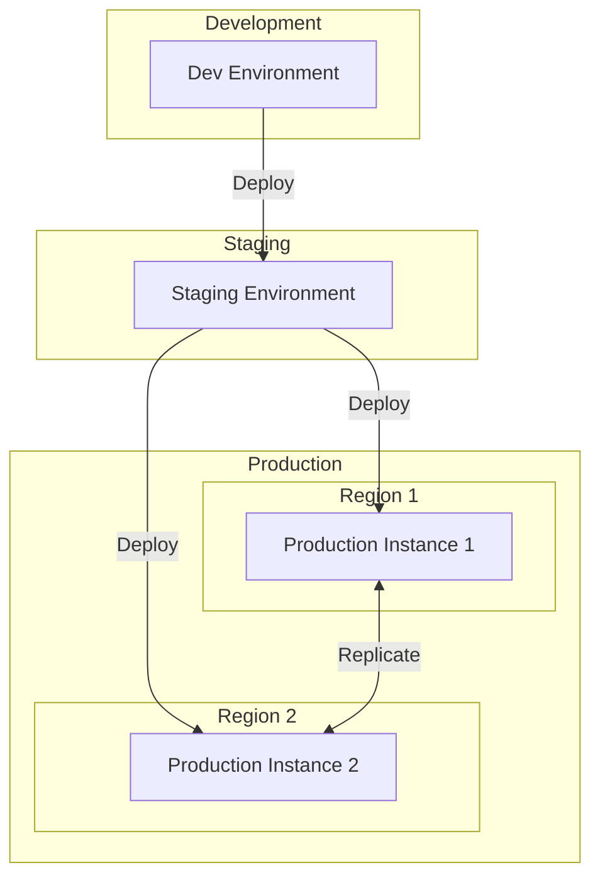

## Scalability & Performance

### Scaling Strategy

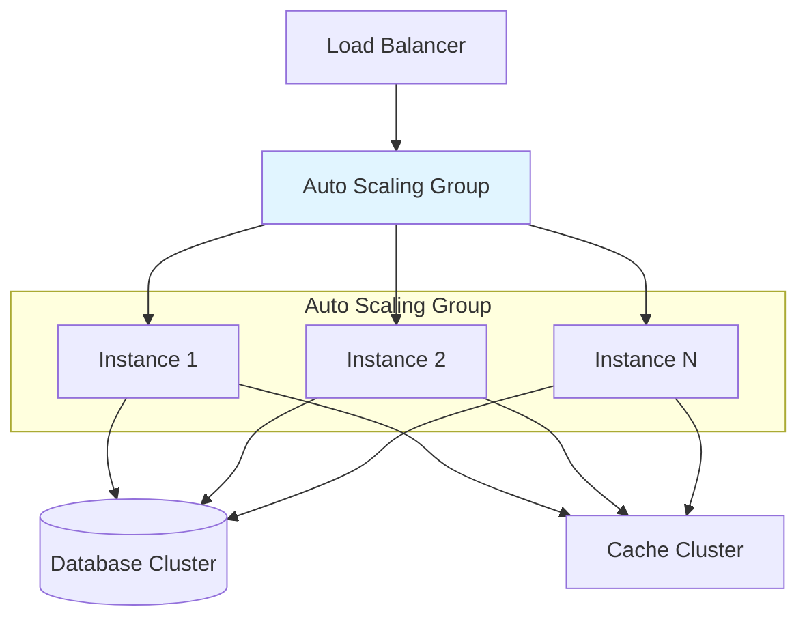

### Caching Strategy

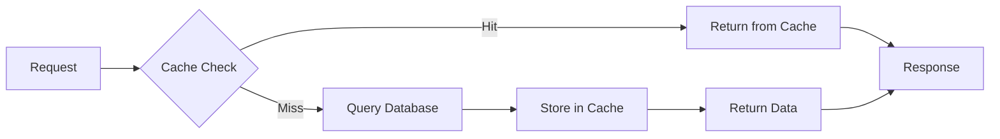

## Monitoring & Observability

### Monitoring Architecture

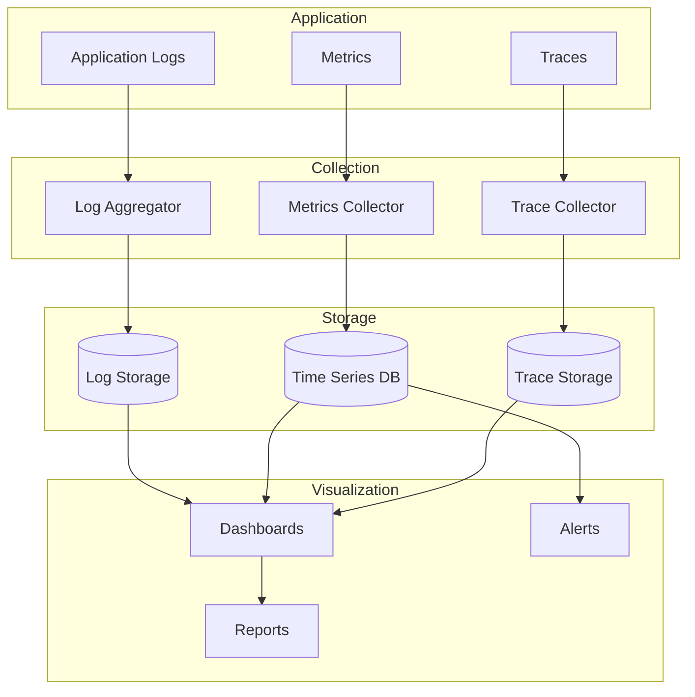

## Disaster Recovery

### Backup Strategy

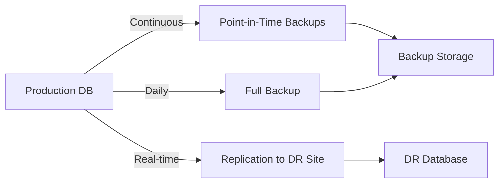

### Failover Process

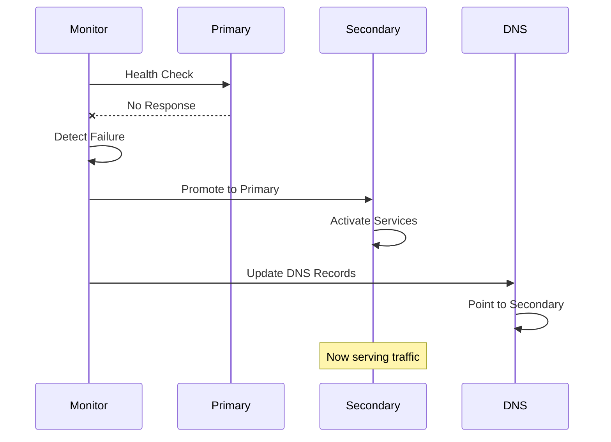

## Technology Stack

### Frontend
- **Framework:** [React/Vue/Angular]
- **Language:** [TypeScript/JavaScript]
- **State Management:** [Redux/MobX/Context API]
- **UI Library:** [Material-UI/Ant Design]

### Backend
- **Runtime:** [Node.js/Python/Java]
- **Framework:** [Express/FastAPI/Spring Boot]
- **Language:** [TypeScript/Python/Java]

### Database
- **Primary Database:** [PostgreSQL/MySQL/MongoDB]
- **Cache:** [Redis/Memcached]
- **Search:** [Elasticsearch/Algolia]

### Infrastructure
- **Cloud Provider:** [AWS/Azure/GCP]
- **Container Orchestration:** [Kubernetes/ECS]
- **CI/CD:** [Jenkins/GitHub Actions/GitLab CI]
- **Monitoring:** [Datadog/New Relic/Prometheus]

## Architecture Decision Records (ADRs)

### ADR-001: [Decision Title]

**Date:** [Date]  
**Status:** [Proposed/Accepted/Deprecated/Superseded]  
**Context:** [What is the issue that we're seeing that is motivating this decision or change]

**Decision:** [What is the change that we're proposing and/or doing]

**Consequences:** [What becomes easier or more difficult to do because of this change]

**Alternatives Considered:**
1. [Alternative 1 and why it was rejected]
2. [Alternative 2 and why it was rejected]

---

### ADR-002: [Decision Title]

**Date:** [Date]  
**Status:** [Proposed/Accepted/Deprecated/Superseded]  
**Context:** [Context]

**Decision:** [Decision]

**Consequences:** [Consequences]

## Quality Attributes

### Performance
- **Response Time:** [Target]
- **Throughput:** [Target]
- **Latency:** [Target]

### Scalability
- **Concurrent Users:** [Target]
- **Data Volume:** [Target]
- **Growth Rate:** [Expected]

### Availability
- **Uptime Target:** [99.9%/99.99%]
- **RTO (Recovery Time Objective):** [Time]
- **RPO (Recovery Point Objective):** [Time]

### Security
- **Compliance:** [GDPR/HIPAA/SOC2]
- **Authentication:** [OAuth/SAML/JWT]
- **Encryption:** [TLS 1.3, AES-256]

## Future Considerations

### Planned Improvements
- [Improvement 1]
- [Improvement 2]

### Technical Debt
- [Debt item 1]
- [Debt item 2]

### Scalability Roadmap
- [Phase 1: Current capacity]
- [Phase 2: Expected growth]
- [Phase 3: Long-term plans]

## References

- [Architecture patterns and references]
- [Related documentation]
- [External resources]

## Glossary

| Term | Definition |
|------|------------|
| API | Application Programming Interface |
| CDN | Content Delivery Network |
| JWT | JSON Web Token |

## Approval

| Role | Name | Date | Signature |
|------|------|------|-----------|
| Architect | | | |
| Technical Lead | | | |
| Security Lead | | | |

## Version History

| Version | Date | Author | Changes |
|---------|------|--------|---------|
| 1.0 | | | Initial version |

