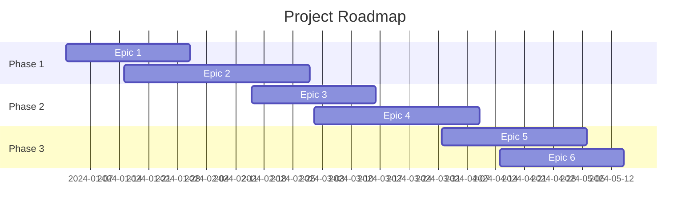
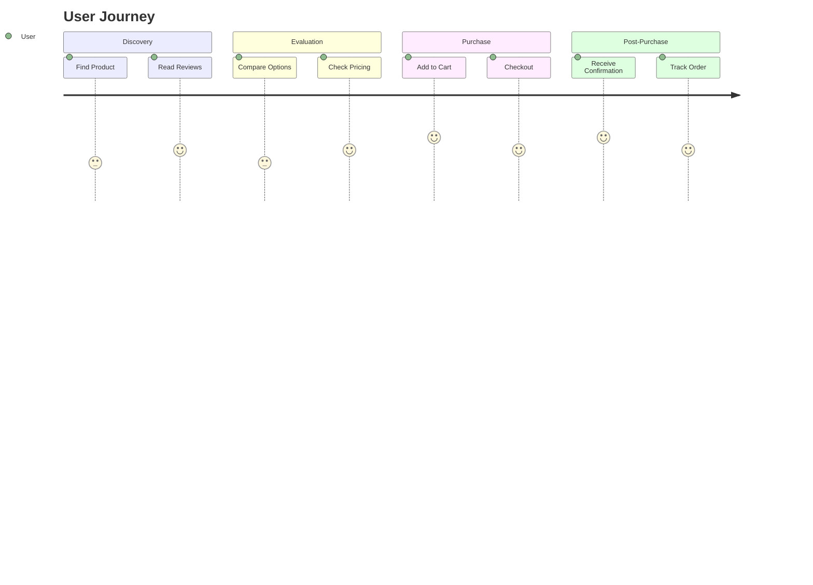
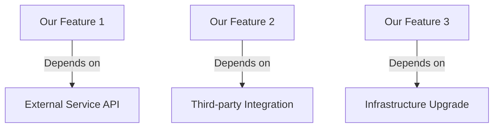

# Project Planning

## Document Information

- **Version:** 1.0
- **Last Updated:** [Date]
- **Author:** [Name]
- **Planning Horizon:** [Time period]

## Project Overview

### Vision
<!-- High-level vision for the project -->

### Goals & Objectives

1. **Goal 1:** [Description]
   - Objective 1.1: [Measurable objective]
   - Objective 1.2: [Measurable objective]

2. **Goal 2:** [Description]
   - Objective 2.1: [Measurable objective]
   - Objective 2.2: [Measurable objective]

## Roadmap

### Timeline Overview



### Milestones

| Milestone | Target Date | Status | Dependencies |
|-----------|-------------|--------|--------------|
| MVP Launch | | | |
| Beta Release | | | |
| Production Release | | | |

## Epics & Features

### Epic 1: [Epic Name]

**Priority:** [Critical/High/Medium/Low]  
**Status:** [Not Started/In Progress/Completed]  
**Owner:** [Team/Person]  
**Target Quarter:** [Q1/Q2/Q3/Q4 YYYY]

#### Description
<!-- Detailed description of the epic -->

#### Business Value
<!-- Why is this important? What value does it provide? -->

#### Success Criteria
- [ ] [Measurable criterion]
- [ ] [Measurable criterion]

#### Features

##### Feature 1.1: [Feature Name]

**Story Points:** [Points]  
**Status:** [Backlog/To Do/In Progress/Review/Done]  
**Assignee:** [Name]

###### User Story
```
As a [user type]
I want to [action]
So that [benefit]
```

###### Acceptance Criteria
- [ ] Given [context], when [action], then [expected result]
- [ ] Given [context], when [action], then [expected result]

###### Technical Notes
<!-- Technical considerations, dependencies, constraints -->

###### Definition of Ready
- [ ] User story is clear and understandable
- [ ] Acceptance criteria are defined
- [ ] Dependencies are identified
- [ ] Technical approach is understood
- [ ] Story is estimated
- [ ] Designs are available (if needed)

###### Definition of Done
- [ ] Code complete and reviewed
- [ ] Unit tests written (>80% coverage)
- [ ] Integration tests passing
- [ ] Documentation updated
- [ ] Deployed to staging
- [ ] Acceptance criteria verified
- [ ] Product owner approval

###### Subtasks
- [ ] [Subtask 1]
- [ ] [Subtask 2]
- [ ] [Subtask 3]

---

##### Feature 1.2: [Feature Name]

**Story Points:** [Points]  
**Status:** [Backlog/To Do/In Progress/Review/Done]  
**Assignee:** [Name]

###### User Story
```
As a [user type]
I want to [action]
So that [benefit]
```

###### Acceptance Criteria
- [ ] Given [context], when [action], then [expected result]

###### Technical Notes
<!-- Technical considerations -->

###### Subtasks
- [ ] [Subtask 1]
- [ ] [Subtask 2]

---

### Epic 2: [Epic Name]

**Priority:** [Critical/High/Medium/Low]  
**Status:** [Not Started/In Progress/Completed]  
**Owner:** [Team/Person]  
**Target Quarter:** [Q1/Q2/Q3/Q4 YYYY]

#### Description
<!-- Detailed description of the epic -->

#### Business Value
<!-- Why is this important? -->

#### Success Criteria
- [ ] [Measurable criterion]

#### Features

##### Feature 2.1: [Feature Name]

**Story Points:** [Points]  
**Status:** [Backlog/To Do/In Progress/Review/Done]

###### User Story
```
As a [user type]
I want to [action]
So that [benefit]
```

###### Acceptance Criteria
- [ ] Given [context], when [action], then [expected result]

---

## Sprint Planning

### Sprint 1: [Sprint Name]

**Duration:** [Start Date] - [End Date]  
**Sprint Goal:** [Clear, concise goal]  
**Capacity:** [Story points or hours]

#### Committed Stories

| ID | Story | Points | Assignee | Status |
|----|-------|--------|----------|--------|
| US-001 | [Story title] | | | |
| US-002 | [Story title] | | | |

#### Sprint Risks
- [Risk 1 and mitigation]

#### Sprint Dependencies
- [Dependency 1]

---

### Sprint 2: [Sprint Name]

**Duration:** [Start Date] - [End Date]  
**Sprint Goal:** [Clear, concise goal]  
**Capacity:** [Story points or hours]

#### Committed Stories

| ID | Story | Points | Assignee | Status |
|----|-------|--------|----------|--------|
| US-003 | [Story title] | | | |

---

## Backlog

### Prioritized Backlog

| Priority | ID | Story | Points | Epic | Status |
|----------|-----|-------|--------|------|--------|
| 1 | US-001 | | | | |
| 2 | US-002 | | | | |

### Backlog Refinement

**Next Session:** [Date]  
**Participants:** [List]

#### Stories to Refine
- [ ] [Story ID]: [Brief description]
- [ ] [Story ID]: [Brief description]

## Story Mapping

### User Journey Map



### Story Map Structure

#### Activity 1: [Activity Name]
- **Task 1.1:** [User task]
  - Story: [Story reference]
- **Task 1.2:** [User task]
  - Story: [Story reference]

#### Activity 2: [Activity Name]
- **Task 2.1:** [User task]
  - Story: [Story reference]

## Technical Stories

### Technical Debt

| ID | Description | Priority | Estimated Effort | Status |
|----|-------------|----------|-----------------|--------|
| TD-001 | | | | |

### Infrastructure Stories

| ID | Description | Priority | Estimated Effort | Status |
|----|-------------|----------|-----------------|--------|
| IS-001 | | | | |

## Dependencies

### External Dependencies



### Internal Dependencies

| Feature | Depends On | Impact if Delayed |
|---------|------------|-------------------|
| | | |

## Resource Planning

### Team Allocation

| Team Member | Role | Capacity | Current Allocation | Available |
|-------------|------|----------|-------------------|-----------|
| | | | | |

### Skills Matrix

| Team Member | Skill 1 | Skill 2 | Skill 3 | Skill 4 |
|-------------|---------|---------|---------|---------|
| | | | | |

## Risk Management

### Planning Risks

| Risk | Probability | Impact | Mitigation | Owner |
|------|-------------|--------|------------|-------|
| | | | | |

## Definition of Ready (DoR)

### Story DoR Checklist
- [ ] User story follows standard format
- [ ] Acceptance criteria are clear and testable
- [ ] Dependencies identified and documented
- [ ] Technical feasibility assessed
- [ ] Story is sized/estimated
- [ ] Business value is clear
- [ ] UI/UX designs available (if applicable)

### Epic DoR Checklist
- [ ] Business value and objectives defined
- [ ] Success criteria established
- [ ] High-level scope defined
- [ ] Dependencies identified
- [ ] Rough timeline estimated
- [ ] Stakeholders identified

## Definition of Done (DoD)

### Story DoD Checklist
- [ ] Code implemented and follows coding standards
- [ ] Code reviewed and approved
- [ ] Unit tests written (>80% coverage)
- [ ] Integration tests passing
- [ ] Documentation updated
- [ ] Security review completed (if applicable)
- [ ] Performance requirements met
- [ ] Accessibility standards met
- [ ] Deployed to staging environment
- [ ] Acceptance criteria verified
- [ ] Product owner sign-off

### Epic DoD Checklist
- [ ] All features completed
- [ ] End-to-end testing completed
- [ ] User acceptance testing passed
- [ ] Production deployment completed
- [ ] Monitoring and alerting configured
- [ ] Documentation finalized
- [ ] Training completed (if applicable)
- [ ] Success metrics baseline established

## Estimation Guidelines

### Story Points Reference

| Points | Complexity | Effort | Risk |
|--------|-----------|--------|------|
| 1 | Very Simple | < 2 hours | None |
| 2 | Simple | 2-4 hours | Low |
| 3 | Medium | 1 day | Low |
| 5 | Complex | 2-3 days | Medium |
| 8 | Very Complex | 4-5 days | High |
| 13 | Epic | 1-2 weeks | High |

### Planning Poker Guidelines
- Use Fibonacci sequence: 1, 2, 3, 5, 8, 13
- Stories > 13 should be broken down
- Estimate based on complexity, not time
- Re-estimate if scope changes significantly

## Metrics & Tracking

### Velocity Tracking

| Sprint | Committed | Completed | Velocity | Team Changes |
|--------|-----------|-----------|----------|--------------|
| Sprint 1 | | | | |
| Sprint 2 | | | | |

### Burndown

<!-- Include burndown chart or link -->

### Key Metrics

| Metric | Current | Target | Trend |
|--------|---------|--------|-------|
| Sprint Velocity | | | |
| Cycle Time | | | |
| Lead Time | | | |
| Defect Rate | | | |

## Communication Plan

### Ceremonies

| Ceremony | Frequency | Duration | Participants | Purpose |
|----------|-----------|----------|--------------|---------|
| Sprint Planning | Every 2 weeks | 2 hours | Dev Team, PO, SM | Plan sprint |
| Daily Standup | Daily | 15 min | Dev Team | Sync progress |
| Sprint Review | Every 2 weeks | 1 hour | Team, Stakeholders | Demo work |
| Sprint Retro | Every 2 weeks | 1 hour | Dev Team | Improve process |
| Backlog Refinement | Weekly | 1 hour | Dev Team, PO | Refine stories |

### Status Reporting

- **Weekly Status:** [Day, Time]
- **Monthly Review:** [Day, Time]
- **Stakeholder Updates:** [Frequency]

## Version History

| Version | Date | Author | Changes |
|---------|------|--------|---------|
| 1.0 | | | Initial version |

