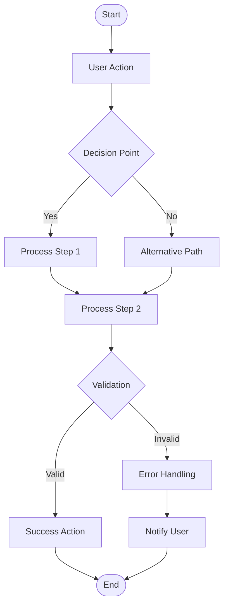
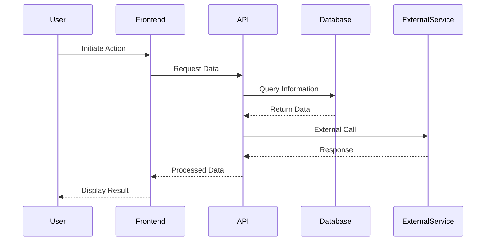
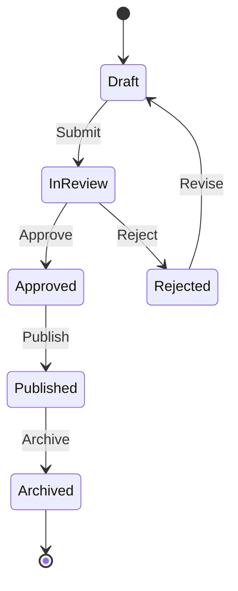
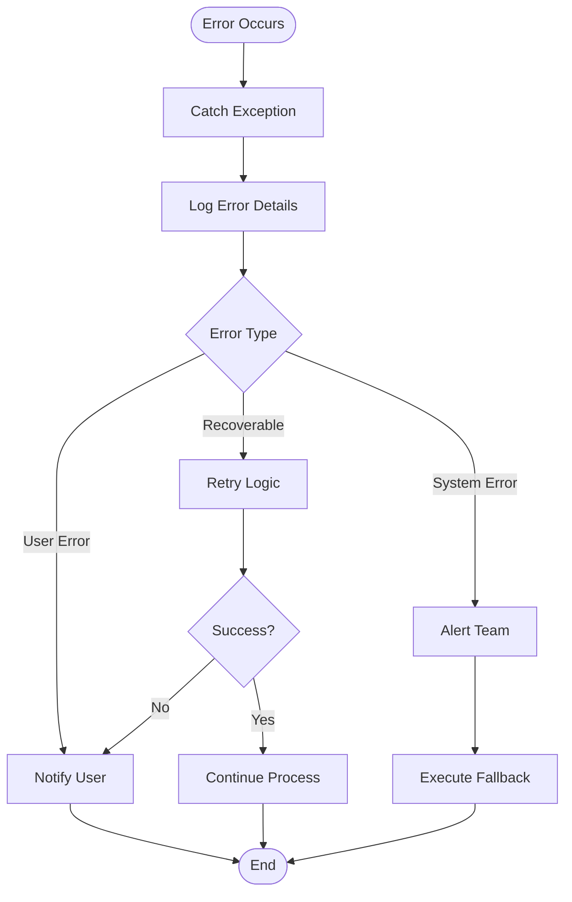
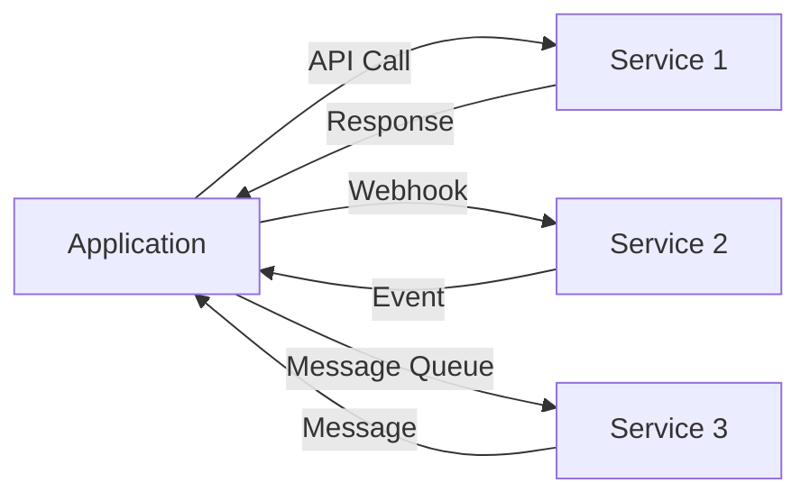
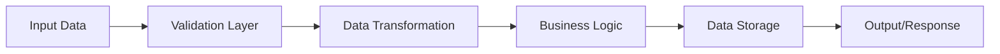

# Process Documentation

## Overview
<!-- Describe the overall process flow and business logic for the use case -->

## Process Flows

### Main Process Flow

#### Description
<!-- Describe the main process in detail -->

#### Process Diagram

#### Steps

1. **Step 1:** [Description]
   - Input: [What is needed]
   - Output: [What is produced]
   - Owner: [Who is responsible]

2. **Step 2:** [Description]
   - Input: [What is needed]
   - Output: [What is produced]
   - Owner: [Who is responsible]

### Sub-Process: [Process Name]

#### Description
<!-- Describe this sub-process -->

#### Sequence Diagram

### State Transitions

#### State Diagram

#### State Definitions

| State | Description | Allowed Transitions |
|-------|-------------|---------------------|
| Draft | Initial state | InReview |
| InReview | Under review | Approved, Rejected |
| Approved | Approved for publication | Published |
| Rejected | Needs revision | Draft |
| Published | Live/Active | Archived |
| Archived | No longer active | - |

### Error Handling Process

#### Error Flow

## Integration Points

### External Systems Integration

### Data Flow

## Business Rules

### Rule 1: [Rule Name]
- **Description:** [Describe the business rule]
- **Conditions:** [When does this rule apply]
- **Actions:** [What happens when rule is triggered]
- **Priority:** [High/Medium/Low]

### Rule 2: [Rule Name]
- **Description:** [Describe the business rule]
- **Conditions:** [When does this rule apply]
- **Actions:** [What happens when rule is triggered]
- **Priority:** [High/Medium/Low]

## Process Metrics

### Performance Metrics

| Metric | Target | Current | Status |
|--------|--------|---------|--------|
| Process Duration | | | |
| Success Rate | | | |
| Error Rate | | | |
| Throughput | | | |

## Edge Cases & Special Scenarios

### Scenario 1: [Scenario Name]
- **Description:** [What makes this case special]
- **Process Variation:** [How the process differs]
- **Handling:** [How it's handled]

### Scenario 2: [Scenario Name]
- **Description:** [What makes this case special]
- **Process Variation:** [How the process differs]
- **Handling:** [How it's handled]

## Process Optimization Opportunities

### Current Pain Points
- 

### Proposed Improvements
- 

## Version History

| Version | Date | Author | Changes |
|---------|------|--------|---------|
| 1.0 | | | Initial version |

