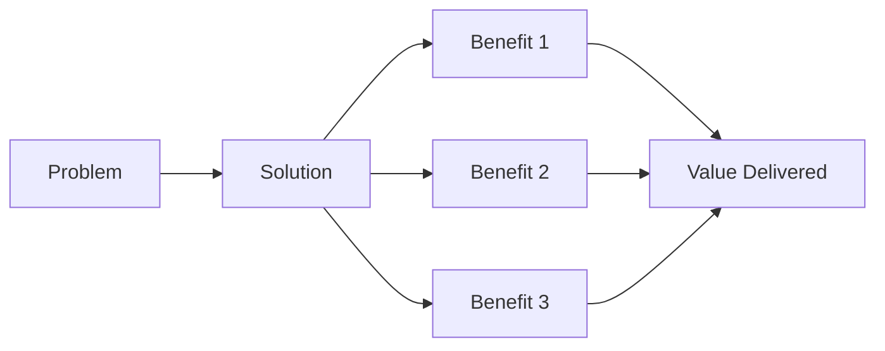
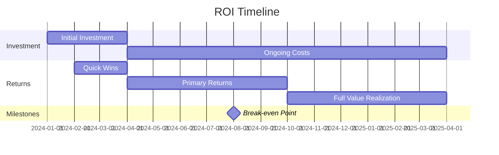

# Value Proposition

## Executive Summary

<!-- Provide a concise summary of the value proposition in 2-3 sentences -->

## Problem Statement

### Current Situation
<!-- Describe the current state and pain points -->

### Pain Points

#### Pain Point 1: [Title]
- **Description:** [Detailed description of the problem]
- **Impact:** [Business impact, cost, inefficiency]
- **Affected Users:** [Who experiences this pain]
- **Frequency:** [How often this occurs]
- **Current Workarounds:** [How people deal with it now]

#### Pain Point 2: [Title]
- **Description:** [Detailed description of the problem]
- **Impact:** [Business impact, cost, inefficiency]
- **Affected Users:** [Who experiences this pain]
- **Frequency:** [How often this occurs]
- **Current Workarounds:** [How people deal with it now]

#### Pain Point 3: [Title]
- **Description:** [Detailed description of the problem]
- **Impact:** [Business impact, cost, inefficiency]
- **Affected Users:** [Who experiences this pain]
- **Frequency:** [How often this occurs]
- **Current Workarounds:** [How people deal with it now]

### Quantifying the Problem

| Metric | Current State | Cost/Impact |
|--------|---------------|-------------|
| Time Lost | | |
| Revenue Impact | | |
| Customer Satisfaction | | |
| Error Rate | | |

## Solution Overview

### Our Solution
<!-- Describe your solution and how it addresses the problems -->

### Key Features

1. **Feature 1:** [Description and benefit]
2. **Feature 2:** [Description and benefit]
3. **Feature 3:** [Description and benefit]

### How It Works
<!-- High-level explanation of the solution -->

## Value Proposition Canvas

### Customer Profile

#### Customer Jobs
<!-- What tasks are customers trying to complete? -->
- 
- 

#### Pains
<!-- What frustrates customers? -->
- 
- 

#### Gains
<!-- What outcomes and benefits do customers want? -->
- 
- 

### Value Map

#### Products & Services
<!-- What do we offer? -->
- 
- 

#### Pain Relievers
<!-- How does our solution alleviate customer pains? -->
- 
- 

#### Gain Creators
<!-- How does our solution create customer gains? -->
- 
- 

## Unique Value Proposition

### One-Line Value Proposition
<!-- Concise statement of value -->
> [Your one-line value proposition]

### Expanded Value Proposition
<!-- Detailed explanation -->

**For** [target customer]  
**Who** [statement of need or opportunity]  
**The** [product/solution name]  
**Is a** [product category]  
**That** [key benefit, compelling reason to buy]  
**Unlike** [primary competitive alternative]  
**Our solution** [statement of primary differentiation]

## Benefits

### Business Benefits

| Benefit | Description | Quantifiable Impact |
|---------|-------------|---------------------|
| Cost Reduction | | |
| Time Savings | | |
| Revenue Growth | | |
| Risk Mitigation | | |
| Efficiency Gain | | |

### User Benefits

| Benefit | Description | Impact |
|---------|-------------|--------|
| Ease of Use | | |
| Productivity | | |
| Satisfaction | | |
| Capabilities | | |

### Technical Benefits

| Benefit | Description | Impact |
|---------|-------------|--------|
| Scalability | | |
| Performance | | |
| Reliability | | |
| Security | | |

## Competitive Advantage

### Differentiation

| Feature/Aspect | Our Solution | Competitor A | Competitor B | Advantage |
|----------------|--------------|--------------|--------------|-----------|
| | | | | |
| | | | | |

### Why Choose Us?

1. **Differentiator 1:** [Description]
2. **Differentiator 2:** [Description]
3. **Differentiator 3:** [Description]

## ROI Analysis

### Investment Required

| Category | Cost | Timeline |
|----------|------|----------|
| Development | | |
| Implementation | | |
| Training | | |
| Maintenance | | |
| **Total** | | |

### Expected Returns

| Benefit | Value | Timeline | Calculation Method |
|---------|-------|----------|-------------------|
| Cost Savings | | | |
| Revenue Increase | | | |
| Efficiency Gains | | | |
| **Total Value** | | | |

### ROI Calculation

- **Total Investment:** $[amount]
- **Expected Annual Return:** $[amount]
- **ROI Percentage:** [X]%
- **Payback Period:** [X] months
- **Break-even Point:** [date/milestone]

### ROI Timeline

## Target Audience

### Primary Users

#### Persona 1: [Name/Role]
- **Profile:** [Description]
- **Goals:** [What they want to achieve]
- **Pain Points:** [Their specific challenges]
- **How We Help:** [Value we provide to them]

#### Persona 2: [Name/Role]
- **Profile:** [Description]
- **Goals:** [What they want to achieve]
- **Pain Points:** [Their specific challenges]
- **How We Help:** [Value we provide to them]

### Secondary Users

#### Persona 3: [Name/Role]
- **Profile:** [Description]
- **Goals:** [What they want to achieve]
- **Pain Points:** [Their specific challenges]
- **How We Help:** [Value we provide to them]

## Market Opportunity

### Market Size
- **Total Addressable Market (TAM):** [Size and description]
- **Serviceable Addressable Market (SAM):** [Size and description]
- **Serviceable Obtainable Market (SOM):** [Size and description]

### Market Trends
- [Trend 1 and how it supports the solution]
- [Trend 2 and how it supports the solution]

### Growth Potential
<!-- Describe growth opportunities and expansion possibilities -->

## Risk Mitigation

### Implementation Risks

| Risk | Impact | Probability | Mitigation Strategy |
|------|--------|-------------|---------------------|
| | | | |

### Value Realization Risks

| Risk | Impact | Probability | Mitigation Strategy |
|------|--------|-------------|---------------------|
| | | | |

## Success Metrics

### Key Performance Indicators

| KPI | Baseline | Target | Timeline | Measurement Method |
|-----|----------|--------|----------|-------------------|
| | | | | |

### Success Criteria
- [ ] [Criterion 1]
- [ ] [Criterion 2]
- [ ] [Criterion 3]

## Validation

### Customer Feedback
<!-- Include quotes or feedback from potential users -->

> "[Customer quote about the solution]"
> — [Name, Title, Company]

### Pilot Results
<!-- If applicable, include results from pilots or proof of concepts -->

| Metric | Before | After | Improvement |
|--------|--------|-------|-------------|
| | | | |

## Next Steps

1. **Immediate:** [Action item]
2. **Short-term:** [Action item]
3. **Long-term:** [Action item]

## References

- [Related documents, market research, case studies]

## Approval

| Role | Name | Date | Signature |
|------|------|------|-----------|
| Product Owner | | | |
| Business Sponsor | | | |
| Finance | | | |

## Version History

| Version | Date | Author | Changes |
|---------|------|--------|---------|
| 1.0 | | | Initial version |

